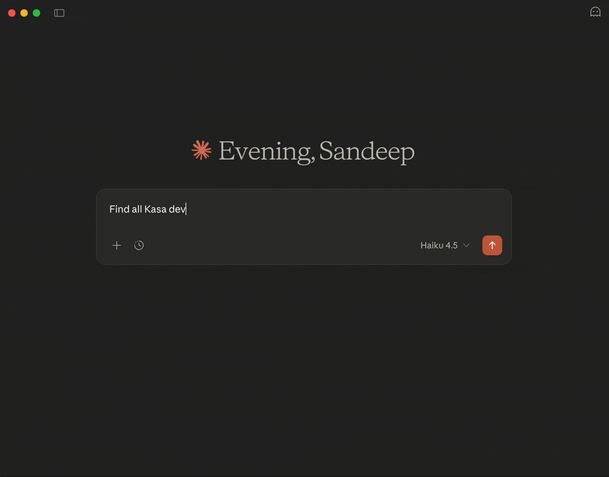

# kasa-mcp

[](https://github.com/sandeepraju/kasa-mcp/actions/workflows/build.yml)
[](https://www.npmjs.com/package/@sandeepraju/kasa-mcp)
[](https://www.npmjs.com/package/@sandeepraju/kasa-mcp)
[](https://opensource.org/licenses/MIT)
[](https://nodejs.org/)
[](https://www.typescriptlang.org/)
[](https://pnpm.io/)



> ⚠️ **Heads up:** This project has no affiliation with TP-Link or Kasa. It's a completely unofficial community project. If something goes wrong and your devices act weird, get bricked, or explode into flames - we're not responsible. Use at your own risk and make sure you understand what you're doing before running this with your actual devices.

> 🤖 **Fair warning:** This whole thing was written by AI (Claude). The code might have weird quirks, might look ugly, might do things in a way that makes experienced developers cringe. It's genuinely untested AI-generated code, so please review it, understand what it does, and use it with caution. You've been warned!

An MCP (Model Context Protocol) server for Kasa smart home devices. Install it as an npx package to integrate Kasa device control with Claude and other MCP-compatible applications.

## Installation and Claude Desktop Configuration

### Step 1: Install the Package

The package is available on npm and can be used via `npx`:

```bash
npx @sandeepraju/kasa-mcp@latest
```

### Step 2: Configure Claude Desktop

#### Locate Your Configuration File

Find your Claude Desktop configuration file:

**macOS:**
```bash
~/Library/Application Support/Claude/claude_desktop_config.json
```

**Windows:**
```
%APPDATA%\Claude\claude_desktop_config.json
```

If the file doesn't exist, create it in the appropriate directory.

#### Edit the Configuration

Add the kasa-mcp server to your `claude_desktop_config.json`:

```json
{
  "mcpServers": {
    "kasa-mcp": {
      "command": "npx",
      "args": ["@sandeepraju/kasa-mcp@latest"]
    }
  }
}
```

**If you already have other MCP servers**, add kasa-mcp alongside them:

```json
{
  "mcpServers": {
    "existing-server": {
      "command": "npx",
      "args": ["existing-server@latest"]
    },
    "kasa-mcp": {
      "command": "npx",
      "args": ["@sandeepraju/kasa-mcp@latest"]
    }
  }
}
```

### Step 3: Restart Claude Desktop

Close and reopen Claude Desktop completely for the changes to take effect. You should see the kasa-mcp server initialize in the Claude interface.

### Step 4: Verify It's Working

Test the connection by:
1. Looking for the kasa-mcp server indicator in Claude
2. Asking Claude: "What tools are available from kasa-mcp?"
3. Or: "List my Kasa devices"

Claude should respond with the available tools from the kasa-mcp server.

### Alternative: Use Local Development Version

If you're developing locally and want to test changes immediately, use the local build path instead:

```json
{
  "mcpServers": {
    "kasa-mcp": {
      "command": "/Users/sandeep/.nvm/versions/node/v20.5.1/bin/node",
      "args": ["/Users/sandeep/projects/github.com/sandeepraju/kasa-mcp/build/index.js"]
    }
  }
}
```

Then rebuild with `pnpm build` after making changes and restart Claude.

## Features

- **Device Discovery**: List all Kasa smart devices on your network
- **Device Control**: Turn devices on/off, adjust brightness, and more
- **Real-time Status**: Get current device status and information
- **TypeScript Support**: Full type safety with TypeScript

## Available Tools

### discover_devices

Discover all Kasa smart devices on your local network via UDP broadcast.

**Parameters:**
- `timeout` (optional, number): Discovery timeout in milliseconds (default: 5000)

**Returns:** List of discovered devices with:
- `deviceId` - Unique identifier for the device
- `alias` - User-friendly device name
- `type` - Device type (plug, bulb, light-strip, etc.)
- `model` - Device model number
- `host` - IP address of the device
- `port` - Port number (typically 9999)

**Example:**
```
Claude: "Discover my Kasa devices"
kasa-mcp: Returns list of all connected Kasa devices with their IP addresses
```

### get_device_info

Get detailed information about a specific Kasa device.

**Parameters:**
- `deviceId` (optional, string): Device ID from discovery
- `host` (optional, string): Device IP address
- `timeout` (optional, number): Operation timeout in milliseconds (default: 30000)
- (Must provide either `deviceId` or `host`)

**Returns:** Complete device system information including:
- Device model and hardware version
- Software version and firmware
- MAC address
- **Current power state** (on/off)
- Device alias/name
- Device type

**Example:**
```
Claude: "Tell me about the device at 192.168.1.100"
kasa-mcp: Returns detailed device specifications and status
```

### set_power_state

Turn a Kasa device on or off.

**Parameters:**
- `deviceId` (optional, string): Device ID from discovery
- `host` (optional, string): Device IP address
- `state` (required, boolean): true = on, false = off
- `timeout` (optional, number): Operation timeout in milliseconds (default: 30000)

**Returns:** Confirmation of power state change

**Example:**
```
Claude: "Turn on the living room plug"
kasa-mcp: Device powered on successfully
```

### set_brightness

Set the brightness level for Kasa smart bulbs (0-100%).

**Parameters:**
- `deviceId` (optional, string): Device ID from discovery
- `host` (optional, string): Device IP address
- `brightness` (required, number): Brightness percentage (0-100)
- `timeout` (optional, number): Operation timeout in milliseconds (default: 30000)

**Returns:** Confirmation of brightness change

**Supported Devices:** Smart bulbs and light strips (LB, KL series)

**Example:**
```
Claude: "Set the bedroom light to 50% brightness"
kasa-mcp: Brightness set to 50%
```

### set_color_temperature

Set the color temperature for Kasa color-tunable bulbs.

**Parameters:**
- `deviceId` (optional, string): Device ID from discovery
- `host` (optional, string): Device IP address
- `temperature` (required, number): Color temperature in Kelvin (2500-9000)
  - 2500K: Warm white
  - 4000K: Neutral white
  - 6500K: Cool white
  - 9000K: Daylight
- `timeout` (optional, number): Operation timeout in milliseconds (default: 30000)

**Returns:** Confirmation of color temperature change

**Supported Devices:** Color bulbs (LB130, LB230, KL125, KL128, KL130, KL430)

**Example:**
```
Claude: "Set the living room light to warm white (3000K)"
kasa-mcp: Color temperature updated
```

### get_realtime_stats

Get real-time energy monitoring statistics for smart plugs.

**Parameters:**
- `deviceId` (optional, string): Device ID from discovery
- `host` (optional, string): Device IP address
- `timeout` (optional, number): Operation timeout in milliseconds (default: 30000)

**Returns:** Current energy usage metrics:
- `power` - Current power consumption in watts (W)
- `voltage` - Current voltage in volts (V)
- `current` - Current amperage in amperes (A)
- `totalConsumption` - Total energy consumed in watt-hours (Wh)

**Supported Devices:** Smart plugs with energy monitoring (HS110, KP303, KP400)

**Example:**
```
Claude: "What's the power usage of my office plug?"
kasa-mcp: Returns current watts, voltage, current, and total consumption
```

## Configuration

### Environment Variables (Kasa-specific)

Configure Kasa device discovery and control:

- `KASA_DISCOVERY_TIMEOUT`: Discovery timeout in milliseconds (default: 30000)
  - Controls how long the `discover_devices` tool waits for device responses
  - Example: `KASA_DISCOVERY_TIMEOUT=10000` (10 seconds)

- `KASA_DEVICE_TIMEOUT`: Device operation timeout in milliseconds (default: 30000)
  - Controls how long device control operations wait for responses
  - Applies to: get_device_info, set_power_state, set_brightness, set_color_temperature, get_realtime_stats
  - Can be overridden per-operation via the timeout parameter
  - Example: `KASA_DEVICE_TIMEOUT=15000` (15 seconds)

### Network Requirements

The kasa-mcp server communicates with Kasa devices using local network protocols. Ensure your network is properly configured:

**Firewall Rules:**
- **UDP Port 9999** - Required for device discovery (broadcast)
- **TCP Port 9999** - Required for device control (Kasa Protocol)

**Network Setup:**
- Server and devices must be on the **same local subnet** (not separated by router VLANs)
- Router must allow UDP broadcast packets
- No VPN or network isolation between server and devices
- For remote/cloud deployments, the server must be deployed on the same network as Kasa devices

**Device Requirements:**
- Kasa devices must be powered on and connected to network
- Devices must be on 2.4 GHz WiFi (some newer models support 5 GHz)
- Device firmware should be up-to-date for best compatibility

### Supported Device Models

**Smart Plugs with Power Monitoring:**
- HS110, HS103, HS105 (older generation)
- KP303, KP400 (current generation)

**Smart Bulbs:**
- LB100, LB110 (non-color tunable)
- LB120, LB130 (color tunable)
- LB200, LB230 (newer generation)
- KL50, KL120, KL125, KL128, KL130 (current generation)

**Light Strips:**
- KL430

**Smart Switches:**
- HS200, HS210, HS220

## HTTP Transport

In addition to stdio transport (for Claude Desktop), kasa-mcp supports HTTP transport for remote access, multiple simultaneous clients, and cloud deployments.

### Transport Modes

**Stdio Mode (Default)**
- Used by Claude Desktop
- Single local process
- No network access
- Simplest setup

**HTTP Stateful Mode**
- Multiple concurrent clients
- Session-based state management
- Server-Sent Events (SSE) support for real-time notifications
- Suitable for web applications and persistent connections

**HTTP Stateless Mode**
- Each request is independent
- No session tracking
- Lower memory overhead
- Suitable for serverless and simple request/response scenarios

### Running with HTTP Transport

#### Using npm Scripts

```bash
# HTTP stateful mode (default for HTTP)
pnpm build
pnpm start:http

# HTTP stateless mode
pnpm start:http:stateless

# Development with auto-rebuild
pnpm dev:http
```

#### Using Environment Variables

```bash
# HTTP stateful (default port 3000, localhost only)
MCP_TRANSPORT=http pnpm start:http

# Custom port
MCP_PORT=8080 MCP_TRANSPORT=http node build/index.js

# Custom host (for network access)
MCP_HOST=0.0.0.0 MCP_TRANSPORT=http node build/index.js

# Stateless mode
MCP_TRANSPORT=http MCP_SESSION_MODE=stateless node build/index.js
```

### HTTP Endpoints

When running in HTTP mode, the server exposes the following endpoints:

- **POST /mcp** - Send JSON-RPC requests
  - Without `MCP-Session-ID` header: Initializes a new session (stateful) or processes request (stateless)
  - With `MCP-Session-ID` header: Processes request in existing session (stateful only)

- **GET /mcp** - Establish SSE stream for notifications (stateful mode only)
  - Requires `MCP-Session-ID` header
  - Receives server-sent events and notifications

- **DELETE /mcp** - Terminate session (stateful mode only)
  - Requires `MCP-Session-ID` header
  - Closes the session and cleans up resources

### Error Responses

In the event of a tool execution error, the server will return a JSON response with the following structure. This is particularly relevant for clients using the HTTP transport directly.

```json
{
  "error": true,
  "tool": "tool_name",
  "code": "ErrorCode",
  "message": "A descriptive error message.",
  "suggestion": "A helpful suggestion for how to resolve the error."
}
```

The `code` field provides a stable, machine-readable error type. Possible values for `code` are:
- `UnknownError`
- `ManagerDisposed`
- `InvalidArguments`
- `DeviceNotFound`
- `UnsupportedOperation`
- `ResourceNotFound`
- `NetworkError`
- `ConnectionTimeout`
- `DiscoveryFailed`

### Testing HTTP Server

#### Using MCP Inspector

```bash
# Start the HTTP server in another terminal
MCP_TRANSPORT=http node build/index.js

# In another terminal, launch MCP Inspector for HTTP
pnpm inspector:http
```

The inspector opens at `http://localhost:6274` and allows you to test the HTTP server.

#### Using curl

**Initialize a session (stateful mode):**

```bash
curl -X POST http://localhost:3000/mcp \
  -H "Content-Type: application/json" \
  -d '{
    "jsonrpc": "2.0",
    "id": 1,
    "method": "initialize",
    "params": {
      "protocolVersion": "2024-11-05",
      "capabilities": {},
      "clientInfo": {
        "name": "test-client",
        "version": "1.0.0"
      }
    }
  }'
```

The response includes a `sessionId` in the headers (check `mcp-session-id`).

**List tools (using session ID):**

```bash
curl -X POST http://localhost:3000/mcp \
  -H "Content-Type: application/json" \
  -H "MCP-Session-ID: <session-id-from-above>" \
  -d '{
    "jsonrpc": "2.0",
    "id": 2,
    "method": "tools/list",
    "params": {}
  }'
```

#### Using TypeScript/JavaScript Client

```typescript
import { Client } from "@modelcontextprotocol/sdk/client/index.js";
import { StreamableHTTPClientTransport } from "@modelcontextprotocol/sdk/client/streamableHttp.js";

const client = new Client(
  {
    name: "kasa-client",
    version: "1.0.0"
  },
  {
    capabilities: {}
  }
);

const transport = new StreamableHTTPClientTransport(
  new URL("http://localhost:3000/mcp")
);

await client.connect(transport);
const tools = await client.listTools();
console.log("Available tools:", tools);
```

### Security Considerations

**Default Configuration (Secure)**
- Server binds to `127.0.0.1` (localhost only)
- DNS rebinding protection enabled automatically
- Session IDs are cryptographically secure UUIDs

**Production Deployment**

For public deployments, use a reverse proxy with HTTPS:

**nginx Example:**

```nginx
server {
    listen 443 ssl http2;
    server_name mcp.example.com;

    ssl_certificate /path/to/cert.pem;
    ssl_certificate_key /path/to/key.pem;

    location /mcp {
        proxy_pass http://127.0.0.1:3000;
        proxy_http_version 1.1;
        proxy_set_header Upgrade $http_upgrade;
        proxy_set_header Connection "upgrade";
        proxy_set_header Host $host;
        proxy_set_header X-Real-IP $remote_addr;
        proxy_set_header X-Forwarded-For $proxy_add_x_forwarded_for;
        proxy_set_header X-Forwarded-Proto $scheme;
        proxy_buffering off;
        proxy_cache off;
    }
}
```

**Docker Example:**

```bash
docker run -d \
  -e MCP_TRANSPORT=http \
  -e MCP_HOST=0.0.0.0 \
  -e MCP_PORT=3000 \
  -p 3000:3000 \
  kasa-mcp:latest
```

### Troubleshooting HTTP Mode

**Port already in use:**

```bash
# Find what's using the port
lsof -i :3000

# Use a different port
MCP_PORT=8080 MCP_TRANSPORT=http node build/index.js
```

**Cannot connect from remote host:**

1. Ensure server is listening on `0.0.0.0`: `MCP_HOST=0.0.0.0`
2. Check firewall allows access to the port
3. Verify network connectivity between client and server
4. For secure access, use HTTPS with a reverse proxy

**Session not found error:**

- Verify you're sending the `MCP-Session-ID` header from the initialize response
- Sessions are lost when the server restarts
- In stateless mode, sessions are not supported

## Usage Examples

### Basic Device Discovery and Control Workflow

1. **Discover your devices:**
   ```
   Claude: "What Kasa devices do I have?"
   → Uses discover_devices tool to find all devices on network
   ```

2. **Get device information:**
   ```
   Claude: "Tell me about the device at 192.168.1.100"
   → Uses get_device_info tool to show device details
   ```

3. **Control device power:**
   ```
   Claude: "Turn off the living room plug"
   → Uses set_power_state tool with state: false
   ```

### Advanced Use Cases

**Smart Lighting Control:**
```
Claude: "Set all the lights in my office to 75% brightness with warm color temperature"
→ Discovers bulbs in the office
→ Sets each bulb to 75% brightness (set_brightness)
→ Sets color temperature to 3000K for warm white (set_color_temperature)
```

**Energy Monitoring:**
```
Claude: "How much power am I using on my desk?"
→ Uses get_realtime_stats to fetch current power consumption
→ Returns watts, voltage, current, and total usage
```

**Device Status Check:**
```
Claude: "Are my Kasa devices online?"
→ Discovers devices and retrieves status for each
→ Reports which devices are online/offline
```

## Development

### Prerequisites

- Node.js 18+
- pnpm (or npm/yarn)

### Setup

```bash
# Install dependencies
pnpm install

# Build the project
pnpm build

# Watch mode for development
pnpm dev

# Run tests
pnpm test

# Run tests in watch mode
pnpm test:watch

# Run tests with coverage
pnpm test:coverage

# Run only unit tests
pnpm test:unit

# Run only integration tests
pnpm test:integration

# Use MCP Inspector for interactive testing
pnpm inspector
```

### MCP Inspector

The MCP Inspector provides an interactive interface for testing the server:

```bash
pnpm inspector
```

Opens at `http://localhost:6274` where you can:
- List available tools
- Test tool calls
- See real-time communication
- Debug issues

### Testing

The project includes a comprehensive test suite using [Vitest](https://vitest.dev/). Tests are organized into unit and integration tests, focusing on behavior and contracts rather than implementation details.

#### Test Structure

- **Unit Tests** (`tests/unit/`): Test individual modules in isolation
  - Configuration loading
  - Schema validation
  - Error handling utilities
  - Device manager behavior

- **Integration Tests** (`tests/integration/`): Test tool handlers and server components
  - All 6 tool handlers with mocked dependencies
  - Tool router and error handling
  - Server factory and handler registration

- **Test Fixtures** (`tests/fixtures/`): Reusable mock factories and test utilities

#### Running Tests

```bash
# Run all tests
pnpm test

# Run tests in watch mode (for development)
pnpm test:watch

# Run tests with coverage report
pnpm test:coverage

# Run only unit tests
pnpm test:unit

# Run only integration tests
pnpm test:integration
```

#### Test Philosophy

The test suite follows these principles:

- **Test behavior, not implementation**: Tests verify what the code does, not how it does it
- **Mock external dependencies**: Kasa API and network calls are mocked
- **Focus on contracts**: Schema validation, error handling, and tool behavior
- **Stable through refactoring**: Tests should pass when internal implementation changes

#### Coverage

The test suite aims for 80%+ coverage on business logic, focusing on:
- Tool handlers and their behavior
- Validation schemas
- Error handling and error messages
- Device manager caching and lookup logic

### Project Structure

```
kasa-mcp/
├── src/
│   ├── index.ts              # Main entry point
│   ├── config/
│   │   └── index.ts          # Configuration management
│   ├── device/
│   │   ├── device-manager.ts # Device operations & caching
│   │   └── types.ts          # Device-related types
│   ├── schemas/
│   │   └── index.ts          # Zod validation schemas
│   ├── server/
│   │   ├── create-server.ts  # MCP server factory
│   │   └── tool-definitions.ts # Tool metadata
│   ├── tools/
│   │   ├── index.ts          # Tool router
│   │   ├── discover-devices.ts
│   │   ├── get-device-info.ts
│   │   ├── set-power-state.ts
│   │   ├── set-brightness.ts
│   │   ├── set-color-temperature.ts
│   │   └── get-realtime-stats.ts
│   ├── transport/
│   │   ├── stdio.ts          # Stdio transport
│   │   ├── http-stateful.ts  # HTTP stateful transport
│   │   └── http-stateless.ts # HTTP stateless transport
│   └── utils/
│       └── error-handling.ts  # Error utilities
├── tests/
│   ├── unit/                 # Unit tests
│   ├── integration/          # Integration tests
│   └── fixtures/             # Test utilities & mocks
├── build/                    # Compiled JavaScript (generated)
├── package.json              # Package configuration
├── tsconfig.json             # TypeScript configuration
├── vitest.config.ts          # Vitest configuration
├── eslint.config.js          # ESLint configuration
├── README.md                 # This file
└── LICENSE                   # MIT License
```

## Publishing

### Before Publishing

1. Update version in `package.json`
2. Update this README with new features
3. Run the test suite: `pnpm test`
4. Verify the build: `pnpm build`
5. Test with MCP Inspector: `pnpm inspector`

### Publishing to npm

```bash
# Login to npm
npm login

# Verify package contents
pnpm pack --dry-run

# Publish
pnpm publish
```

### Testing Published Version

```bash
# Test the published package
npx @sandeepraju/kasa-mcp@latest
```

## Architecture

### Transports

The server supports multiple transport mechanisms:

**Stdio Transport (Default)**
- Used by Claude Desktop
- Direct integration via stdin/stdout
- No network configuration required
- Secure local-only communication
- Compatible with any MCP client

**HTTP Transport**
- Remote access and cloud deployments
- Supports multiple concurrent clients
- Stateful (session-based) and stateless modes
- Server-Sent Events (SSE) for real-time notifications
- Requires explicit activation via `MCP_TRANSPORT=http`

### Request Handlers

The server implements these MCP protocol handlers:

- **ListToolsRequest**: Provides list of available tools
- **CallToolRequest**: Executes requested tool
- **ListResourcesRequest**: Lists available resources
- **ReadResourceRequest**: Reads resource content

All handlers are available in both stdio and HTTP transport modes.

## Troubleshooting

### Claude Desktop doesn't recognize the server

1. Verify the configuration file is valid JSON:
   - Use a JSON validator to check for syntax errors
   - Ensure proper comma placement between server entries

2. Make sure the file path is correct:
   - **macOS**: `~/Library/Application Support/Claude/claude_desktop_config.json`
   - **Windows**: `%APPDATA%\Claude\claude_desktop_config.json`

3. Restart Claude Desktop completely:
   - Force quit the application
   - Reopen Claude Desktop
   - Wait a few seconds for the server to initialize

4. Check if the server is running:
   ```bash
   source ~/.zshrc  # Load environment variables
   timeout 2 kasa-mcp || true
   ```

### Server won't start

Check that Node.js 18+ is installed:

```bash
node --version
```

If Node.js is too old, install a newer version:
```bash
# Using Homebrew
brew install node@20
```

### MCP Inspector connection fails

Ensure the server can start independently:

```bash
pnpm build
node build/index.js
```

If it still fails, check for error messages and ensure dependencies are installed:
```bash
pnpm install
pnpm build
```

### Kasa Device Discovery Issues

**No devices found after running discover_devices:**

1. **Check physical connectivity:**
   - Ensure all Kasa devices are powered on
   - Verify devices are connected to the WiFi network
   - Check device LED indicators for connection status

2. **Verify network configuration:**
   - Server and devices must be on the **same subnet** (not different VLANs)
   - Confirm router allows UDP broadcast (port 9999)
   - Check firewall isn't blocking the MCP server

3. **Test device connectivity:**
   - From the server, try to ping a known device IP: `ping 192.168.1.100`
   - If ping fails, devices are unreachable - check network setup

4. **Try direct device access:**
   - Instead of discovery, use `get_device_info` with the device's IP address directly
   - Example: `get_device_info` with `host: "192.168.1.100"`

5. **Check Kasa app:**
   - Open official TP-Link Kasa app to verify devices are reachable
   - If devices work in Kasa app but not in kasa-mcp, there may be a network isolation issue

**Device discovery timeout:**
- The default timeout is 5 seconds
- On slow networks, increase the timeout: `discover_devices` with `timeout: 10000` (10 seconds)

### Devices Found but Can't Control Them

1. **Verify device is online:**
   - Use `get_device_info` to check device status
   - If device returns error, it's offline or unreachable

2. **Check command compatibility:**
   - Verify device supports the operation (e.g., only bulbs support brightness)
   - Refer to supported device models section above

3. **Device firmware:**
   - Update device firmware to latest version via Kasa app
   - Some features may require recent firmware versions

### Device Control Command Fails

**"Device not found" error:**
- Verify the device ID or host IP is correct
- Device may have lost power or connection - try rediscovery

**"Operation not supported" error:**
- Device doesn't support this feature (e.g., setting brightness on a non-dimmable bulb)
- Check device model and supported features

**"Timeout" or "No response" error:**
- Device is offline or unreachable - check network connectivity
- Try again in a few moments
- Verify device is on same network as server

### Configuration file not found (Windows)

If `%APPDATA%\Claude\claude_desktop_config.json` doesn't exist:

1. Create the directory: `%APPDATA%\Claude\`
2. Create a new file called `claude_desktop_config.json`
3. Add the configuration from Step 2 above
4. Save and restart Claude Desktop

## Contributing

Contributions are welcome! Please:

1. Fork the repository
2. Create a feature branch
3. Make your changes
4. Test with MCP Inspector
5. Submit a pull request

## Future Enhancements

- Support for more device types (switches, outlets, plugs)
- Energy monitoring and reporting
- Automation and scheduling
- Multi-network support
- Device grouping and scene control

## License

MIT - See LICENSE file for details

## Resources

- [Model Context Protocol Documentation](https://modelcontextprotocol.io)
- [MCP Inspector](https://modelcontextprotocol.io/docs/tools/inspector)
- [Kasa Smart Home Devices](https://www.tp-link.com/us/kasa-smart-home/)
